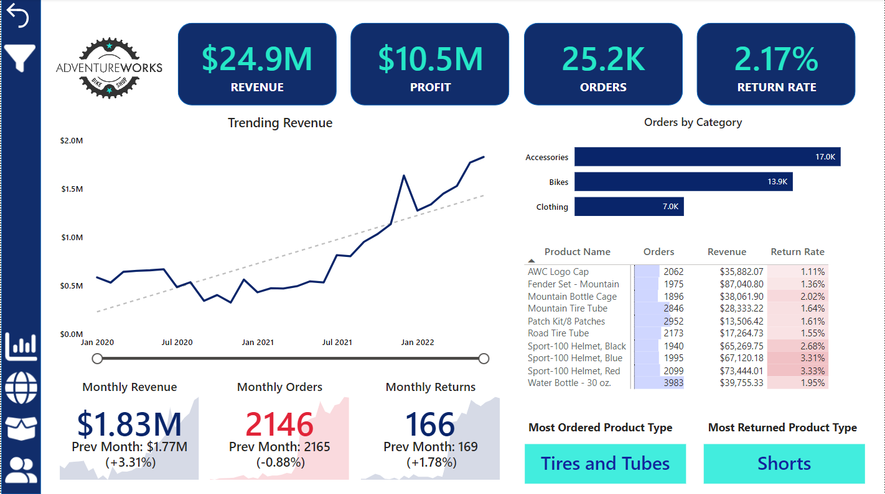
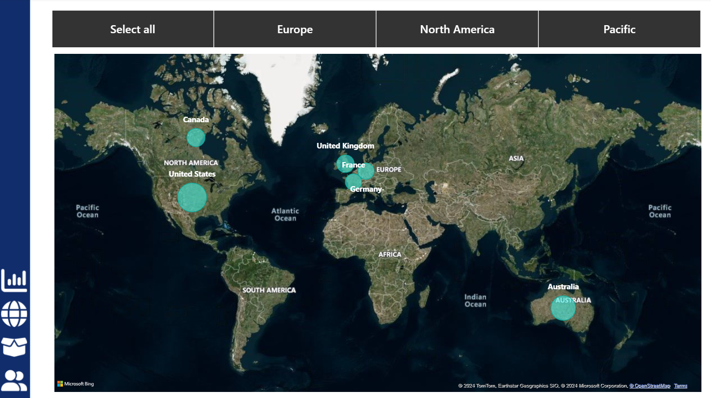
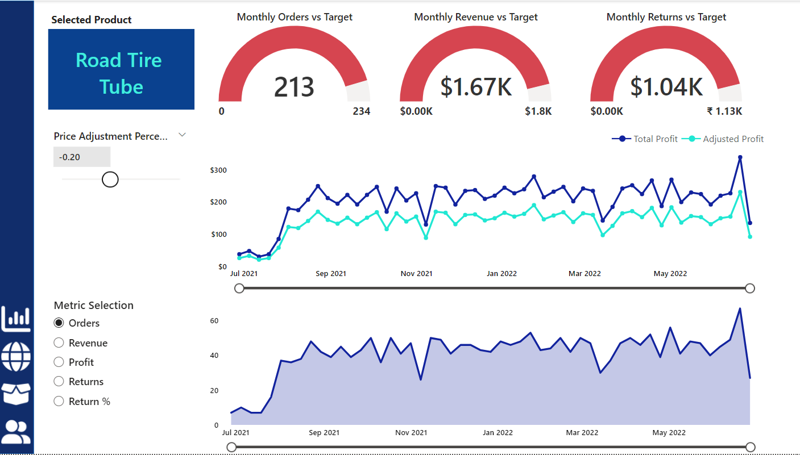
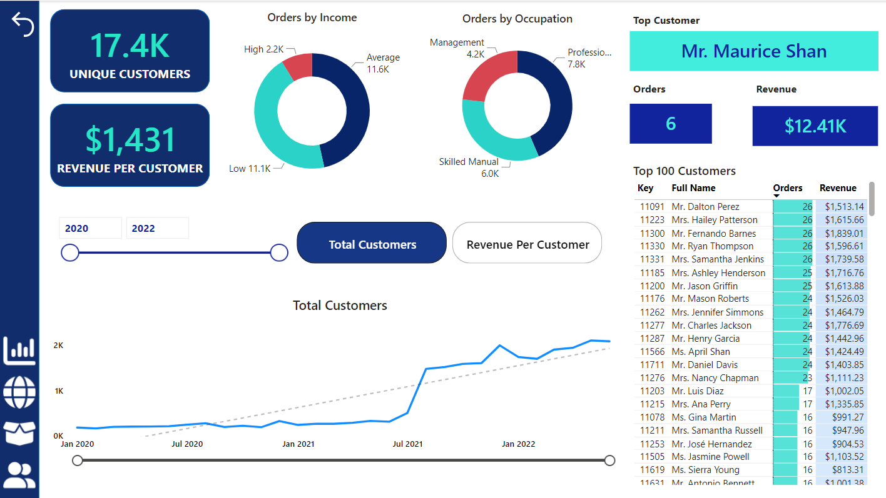

# Adventure Works Report & Dashboard

A custom dashboard I created using Power BI! I used the Adventure Works dataset for this endeavor, a fictional company that sells bicycles, clothing, and accessories. 

The project's core objectives are to create a dynamic Business Intelligence solution using Power BI Desktop that connects and transforms raw data from CSV files, establishes a robust relational data model, employs Data Analysis Expressions (DAX) to calculate crucial KPIs (sales, revenue, profit, returns), facilitates regional performance comparisons, delves into product-level trends, and identifies high-value customers.

In this report, you'll find a wide array of visuals, including bar charts, tables, and line graphs, which offer a granular view of Adventure Works' sales performance over time. I've also leveraged Power BI's advanced features such as slicers, DAX (Basics), and bookmarks, all the while establishing relationships between data tables to ensure a user-friendly experience. This allows viewers to not only dive deeper into the data but also customize their view to extract the precise information they seek.

The report is meticulously detailed, encompassing product-level information and customer-level insights, empowering the company to scrutinize specific product performance and delve into customer behavior patterns.

## Overview

### Dashboard Design
- Identify key performance indicators (KPIs).
- Design an intuitive, visually engaging dashboard.
- Implement interactive visualizations and filtering capabilities for detailed data exploration.

### Data Insights
- Deliver valuable insights to business stakeholders on the effectiveness of their sales strategies.
- Utilize various visualizations and charts to present data.
  
### Strategic Insights and Recommendations
- Aim to provide insights and actionable information to drive strategic decisions supporting the supermarket's goals for growth, efficiency, and customer satisfaction.

## Key Learnings
- Applied data analysis techniques, with a focus on time series analysis.
- Delivered valuable insights and accurate sales forecasts.
- Created interactive dashboards to drive business success.
- 

## Screenshots

- Dashboard

- Map View

- Products

- Customers

